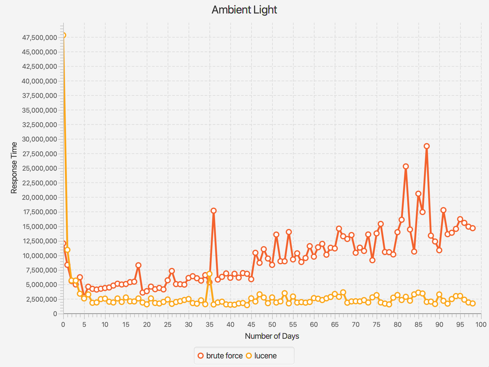

# Project structure
There are four classes in this project: 
    Main
    Unizip
    BruteForceSearch
    LuceneSearch

# Comparison Line Chart

# demo

ambient light: 
total hits：112 hits
total hits：316 hits
total hits：493 hits
total hits：656 hits
total hits：695 hits
total hits：751 hits
total hits：795 hits
total hits：857 hits
total hits：942 hits
total hits：1006+ hits
total hits：1147+ hits
total hits：1224+ hits
total hits：1263+ hits
total hits：1341+ hits
total hits：1392+ hits
total hits：1496+ hits
total hits：1627+ hits
total hits：1745+ hits
total hits：1838+ hits
total hits：1897+ hits
total hits：1968+ hits
total hits：2054+ hits
total hits：2159+ hits
total hits：2246+ hits
total hits：2327+ hits
total hits：2491+ hits
total hits：2547+ hits
total hits：2597+ hits
total hits：2669+ hits
total hits：2780+ hits
total hits：2853+ hits
total hits：2932+ hits
total hits：3064+ hits
total hits：3180+ hits
total hits：3313+ hits
total hits：3437+ hits
total hits：3500+ hits
total hits：3666+ hits
total hits：3800+ hits
total hits：3824+ hits
total hits：3869+ hits
total hits：3903+ hits
total hits：3950+ hits
total hits：3989+ hits
total hits：4035+ hits
total hits：4146+ hits
total hits：4270+ hits
total hits：4375+ hits
total hits：4509+ hits
total hits：4658+ hits
total hits：4791+ hits
total hits：4850+ hits
total hits：4928+ hits
total hits：5079+ hits
total hits：5278+ hits
total hits：5384+ hits
total hits：5460+ hits
total hits：5545+ hits
total hits：5591+ hits
total hits：5663+ hits
total hits：5734+ hits
total hits：5818+ hits
total hits：5862+ hits
total hits：5941+ hits
total hits：5997+ hits
total hits：6134+ hits
total hits：6180+ hits
total hits：6244+ hits
total hits：6312+ hits
total hits：6401+ hits
total hits：6471+ hits
total hits：6516+ hits
total hits：6608+ hits
total hits：6663+ hits
total hits：6704+ hits
total hits：6912+ hits
total hits：7011+ hits
total hits：7050+ hits
total hits：7198+ hits
total hits：7325+ hits
total hits：7439+ hits
total hits：7550+ hits
total hits：7617+ hits
total hits：7701+ hits
total hits：7809+ hits
total hits：7900+ hits
total hits：8005+ hits
total hits：8050+ hits
total hits：8118+ hits
total hits：8178+ hits
total hits：8274+ hits
total hits：8415+ hits
total hits：8548+ hits
total hits：8664+ hits
total hits：8784+ hits
total hits：8875+ hits
total hits：8978+ hits
total hits：9033+ hits
total hits：9081+ hits
ambient light brute force: [14809806, 6485135, 9405044, 5288294, 5048344, 5588406, 4645582, 6643258, 6122823, 5574287, 5158540, 4540184, 5860309, 6350660, 4736825, 5938713, 5667639, 5307968, 6212353, 7235885, 3704615, 3883215, 4079206, 4369236, 5802178, 4108898, 4552573, 4536434, 7825506, 4369026, 4324093, 4507368, 7906293, 7930565, 4914869, 14634578, 5156845, 5681063, 12530063, 5554096, 5724617, 13818213, 5689118, 5542377, 5583681, 11039952, 15754053, 11503783, 12246630, 11853944, 12213801, 12432845, 12346130, 12951149, 12712924, 18054848, 12615787, 13128987, 13243697, 18833536, 13628506, 13745773, 13816946, 7828198, 8077846, 13952822, 19294372, 14194104, 8239673, 8907369, 18379673, 8777974, 15338053, 9142551, 9593511, 9292383, 15198459, 14752886, 14877888, 15869119, 9878017, 16373326, 16510020, 17586832, 21722831, 17779480, 15142125, 17113915, 14925598, 17133580, 13230937, 17467275, 16745948, 12355422, 18865144, 18357596, 16538131, 19914446, 17082743]
ambient light lucene: [29708276, 8945952, 4259954, 1895324, 2308250, 1659288, 2299482, 1327405, 1279969, 1690195, 2457315, 1847197, 2126817, 1265863, 1219569, 1189696, 1652515, 1398937, 1288717, 1755395, 1151133, 1638640, 1191637, 1486730, 1198189, 1085233, 1414034, 1403645, 1118395, 1250826, 1033649, 1999678, 2062449, 1019758, 2117920, 1411879, 1194466, 2156521, 1007717, 1033407, 1102379, 1080064, 1109994, 1022149, 2441922, 2361284, 2360791, 3145692, 2244932, 2367587, 2556464, 2178898, 2365881, 2340055, 2511972, 2460354, 2495006, 2815592, 2552170, 2442792, 2620853, 2467971, 1103219, 1239485, 2321346, 2332691, 2679989, 1124317, 1132022, 1215666, 1515082, 2707469, 1166091, 1254644, 1821513, 2832281, 2432991, 2185049, 3008250, 1187510, 3090805, 3155411, 2573904, 2735470, 3215468, 2442703, 3191511, 2883428, 3337833, 1919227, 2956376, 3134978, 1634421, 2934397, 3076662, 2397628, 2896560, 2896799, 1319540]

heart rate：
total hits：0 hits
total hits：0 hits
total hits：0 hits
total hits：0 hits
total hits：0 hits
total hits：0 hits
total hits：0 hits
total hits：0 hits
total hits：0 hits
total hits：0 hits
total hits：0 hits
total hits：0 hits
total hits：1 hits
total hits：1 hits
total hits：1 hits
total hits：1 hits
total hits：1 hits
total hits：1 hits
total hits：1 hits
total hits：1 hits
total hits：1 hits
total hits：1 hits
total hits：1 hits
total hits：1 hits
total hits：1 hits
total hits：1 hits
total hits：1 hits
total hits：1 hits
total hits：1 hits
total hits：1 hits
total hits：1 hits
total hits：1 hits
total hits：1 hits
total hits：3 hits
total hits：5 hits
total hits：5 hits
total hits：5 hits
total hits：6 hits
total hits：6 hits
total hits：6 hits
total hits：6 hits
total hits：6 hits
total hits：6 hits
total hits：6 hits
total hits：6 hits
total hits：7 hits
total hits：7 hits
total hits：7 hits
total hits：7 hits
total hits：7 hits
total hits：7 hits
total hits：7 hits
total hits：7 hits
total hits：8 hits
total hits：8 hits
total hits：8 hits
total hits：8 hits
total hits：8 hits
total hits：8 hits
total hits：8 hits
total hits：8 hits
total hits：8 hits
total hits：8 hits
total hits：9 hits
total hits：9 hits
total hits：10 hits
total hits：10 hits
total hits：10 hits
total hits：10 hits
total hits：10 hits
total hits：10 hits
total hits：10 hits
total hits：10 hits
total hits：10 hits
total hits：10 hits
total hits：11 hits
total hits：11 hits
total hits：11 hits
total hits：11 hits
total hits：11 hits
total hits：12 hits
total hits：12 hits
total hits：12 hits
total hits：12 hits
total hits：12 hits
total hits：12 hits
total hits：12 hits
total hits：12 hits
total hits：12 hits
total hits：12 hits
total hits：12 hits
total hits：12 hits
total hits：13 hits
total hits：13 hits
total hits：13 hits
total hits：14 hits
total hits：14 hits
total hits：14 hits
total hits：14 hits
heart rate brute force: [2066246, 586780, 615357, 684623, 845475, 778441, 796499, 811694, 2354442, 899000, 933571, 989944, 1092826, 1052316, 1437686, 2343970, 1335447, 1327210, 1752072, 2953752, 2699828, 1478217, 1499108, 1583144, 1508005, 3506390, 4035240, 3996948, 3819224, 3631363, 3249541, 4251551, 4136402, 1882352, 4203283, 4440615, 3507802, 4167982, 4604549, 6360474, 4441689, 4638704, 3148267, 4895069, 4475487, 2483905, 2604206, 2850497, 2629790, 2557536, 2539185, 2734562, 2629904, 4630490, 8072156, 5942523, 5205548, 2908500, 6058900, 4806314, 5826114, 6342026, 5890237, 6613033, 5163000, 3244227, 3552140, 3389334, 7472953, 7875054, 7027119, 7667340, 6807458, 7327717, 8853734, 6754058, 5102799, 8079826, 7263227, 4128472, 3810556, 4826592, 7454135, 10254735, 8523128, 8587554, 8430111, 8511647, 4893106, 8467220, 8836027, 8565512, 8018304, 8146317, 4352588, 5194292, 4514079, 4959586, 4492218]
heart rate lucene: [65931, 68816, 80543, 66480, 95723, 64300, 114187, 176028, 72142, 72340, 82628, 67750, 288897, 297540, 617758, 266169, 192483, 203461, 374039, 256249, 166861, 199737, 144264, 139550, 388852, 295401, 505839, 368122, 491843, 395668, 364827, 361510, 149629, 469805, 475089, 563732, 700408, 913823, 400792, 358529, 441000, 411704, 881515, 421138, 183634, 246394, 288623, 210703, 226325, 196124, 437650, 199685, 321288, 624009, 395684, 357590, 197995, 439056, 322428, 352386, 367086, 393299, 435975, 293292, 244233, 194646, 205843, 464609, 348714, 525720, 475327, 329947, 319411, 469561, 354542, 279099, 489026, 386543, 277995, 184972, 287971, 379826, 374250, 375140, 378297, 542415, 408389, 256648, 391288, 535806, 2504294, 383908, 415239, 200301, 235286, 208605, 227727, 229913, 457795]

physical activity: 
total hits：0 hits
total hits：0 hits
total hits：0 hits
total hits：0 hits
total hits：0 hits
total hits：0 hits
total hits：0 hits
total hits：0 hits
total hits：0 hits
total hits：0 hits
total hits：0 hits
total hits：0 hits
total hits：0 hits
total hits：0 hits
total hits：0 hits
total hits：0 hits
total hits：0 hits
total hits：0 hits
total hits：0 hits
total hits：0 hits
total hits：0 hits
total hits：0 hits
total hits：0 hits
total hits：0 hits
total hits：0 hits
total hits：0 hits
total hits：0 hits
total hits：0 hits
total hits：0 hits
total hits：0 hits
total hits：0 hits
total hits：0 hits
total hits：0 hits
total hits：0 hits
total hits：0 hits
total hits：0 hits
total hits：0 hits
total hits：0 hits
total hits：0 hits
total hits：0 hits
total hits：0 hits
total hits：0 hits
total hits：0 hits
total hits：0 hits
total hits：0 hits
total hits：0 hits
total hits：0 hits
total hits：0 hits
total hits：0 hits
total hits：0 hits
total hits：0 hits
total hits：0 hits
total hits：2 hits
total hits：2 hits
total hits：3 hits
total hits：3 hits
total hits：3 hits
total hits：3 hits
total hits：3 hits
total hits：3 hits
total hits：3 hits
total hits：3 hits
total hits：3 hits
total hits：3 hits
total hits：3 hits
total hits：3 hits
total hits：3 hits
total hits：3 hits
total hits：3 hits
total hits：3 hits
total hits：3 hits
total hits：3 hits
total hits：3 hits
total hits：3 hits
total hits：3 hits
total hits：3 hits
total hits：3 hits
total hits：3 hits
total hits：3 hits
total hits：3 hits
total hits：3 hits
total hits：3 hits
total hits：3 hits
total hits：3 hits
total hits：3 hits
total hits：3 hits
total hits：3 hits
total hits：3 hits
total hits：3 hits
total hits：3 hits
total hits：3 hits
total hits：3 hits
total hits：3 hits
total hits：3 hits
total hits：3 hits
total hits：3 hits
total hits：3 hits
total hits：3 hits
total hits：3 hits
physical activity brute force: [3273791, 1327179, 1398546, 1214777, 1372541, 1109100, 1710848, 1915531, 2154410, 2247665, 2498668, 1082507, 1276109, 2046480, 1212461, 1236042, 1238467, 1354599, 2793176, 3014803, 3048034, 1539175, 3244788, 3347112, 2892008, 3298722, 3111664, 3517970, 3568641, 1854829, 3717222, 3899002, 3924976, 4528929, 2069320, 2711594, 3917927, 2189582, 3513145, 3988189, 4306014, 3980655, 2394062, 4774355, 3771175, 4511592, 3357296, 5135759, 5168671, 3853380, 4682594, 4813014, 5791783, 5606479, 5751510, 8158022, 4066603, 2872883, 3281682, 3491468, 3902095, 3192248, 3057853, 3252964, 3149228, 3210141, 3411295, 3228490, 4657988, 9272082, 3449387, 3484102, 3566907, 3468867, 3735612, 8675384, 6832183, 3863530, 3759393, 6969192, 7899823, 9831857, 3805253, 7974449, 8154698, 4190379, 3940857, 4045414, 5067596, 7855214, 4406226, 4080598, 4067561, 7942643, 8382661, 8626737, 9106148, 9382207, 5250264]
physical activity lucene: [169743, 114029, 70882, 85084, 60768, 81478, 80792, 112462, 113007, 84196, 51204, 61567, 81119, 48750, 48079, 73579, 74739, 89270, 87899, 87985, 47076, 132323, 131085, 72311, 93967, 104539, 80376, 146846, 111842, 83593, 115947, 119445, 81912, 73478, 59774, 90271, 73214, 73451, 87950, 85599, 75659, 62178, 91161, 79995, 85618, 78357, 84620, 116395, 75741, 86538, 88464, 154130, 744578, 407807, 586438, 264912, 123109, 148019, 202253, 136913, 136710, 171937, 123404, 126914, 127996, 121768, 126730, 206610, 313853, 146850, 137146, 136273, 125049, 119781, 214460, 230158, 115514, 127996, 281891, 223063, 285743, 138711, 275273, 215944, 126554, 116888, 177384, 155139, 211389, 205863, 165792, 124362, 240964, 222156, 252620, 391307, 299130, 156636, 190049]

Process finished with exit code 0
